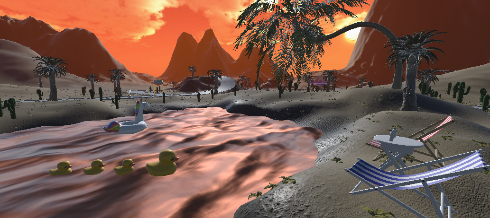
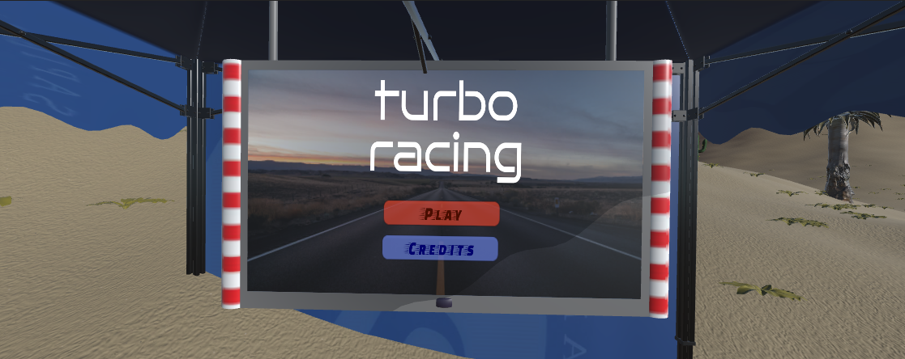
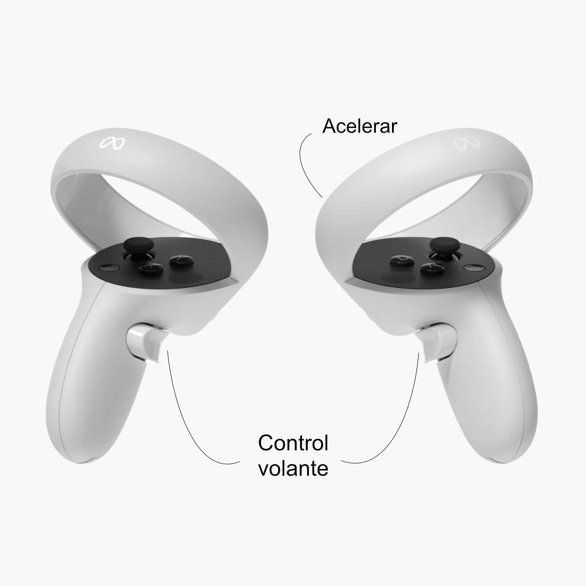
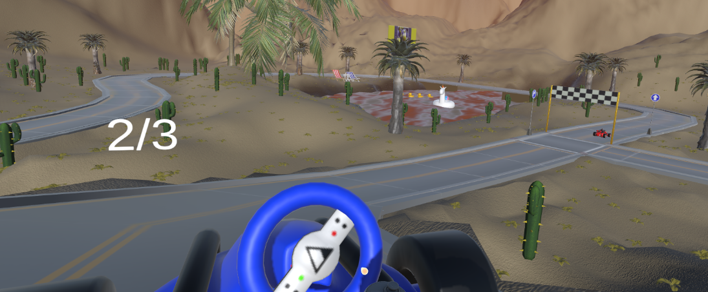
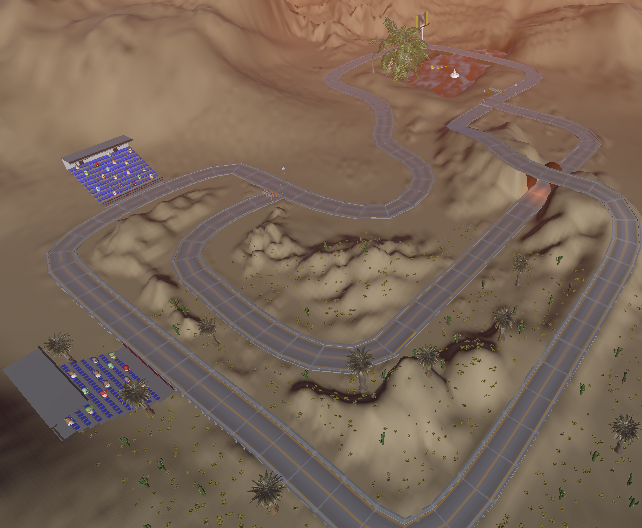

# 🗲 TurboRacing 🗲

**TurboRacing** es un juego de carreras **multijugador en realidad virtual**, ambientado en el desierto de Tabernas, que ofrece una experiencia de conducción **totalmente inmersiva**.

Los jugadores compiten en una pista con distintas zonas destacadas como:
- 🌴 Un oasis
- 🎢 Zona recreativa
- 🏟️ Gradas
- 🚇 Un túnel central



---

## 🗲 Características principales

- Compatible con **Realidad Virtual**
- Multijugador online (Photon Fusion)
- Conducción inmersiva con volante y acelerador
- Escenario detallado inspirado en el desierto de Tabernas
- Sistema de vueltas y victoria en tiempo real

---

## 🗲 Contenidos

- [Escenas](#-escenas)
- [Jugabilidad](#-jugabilidad)
- [Tecnologías usadas](#-tecnologías-usadas)
- [Descarga](#-descarga)
- [Créditos](#-créditos)

---

## 🗲 Escenas 

### Escena principal
Desde esta escena el jugador puede:
- Iniciar una partida
- Acceder a los créditos
- Conectarse al modo multijugador



---

### Escena de juego
Durante la carrera el jugador controla el coche en VR mediante:
- Volante
- Acelerador
- Mandos VR

<p align="center">
  
</p>


Esta sería la escena a visualizar:



---

### Pista
Este es el circuito completo visto desde arriba:



---


## 🗲 Jugabilidad

- El objetivo es completar **3 vueltas** antes que el otro jugador.
- El primero en cruzar la meta final gana la carrera.
- Cada jugador ve el resultado final según haya ganado o perdido.

---

## 🗲 Tecnologías usadas

- **Unity**
- **C#**
- **Photon Fusion** (multijugador)
- **XR Interaction Toolkit**

---

## 🗲 Descarga

1. Clona el repositorio:
   ```bash
   git clone https://github.com/AlbaMarm/TurboRacing2.git
2. Abre el proyecto en Unity Hub.
3. Asegúrate de tener instalado:
    ```bash
    - XR Interaction Toolkit
    - Input System
4. Abre la escena principal desde:
    - Assets/Scenes/Montado/Inicio Editado
5. Conecta tu visor de Realidad Virtual y ejecuta el proyecto. 
Este juego es multijugador y por lo tanto se permite competir online entre dos jugadores en tiempo real.


---

## 🗲 Creditos

Este videojuego ha sido realizado por:
- Alba Marmolejo Ramos - [AlbaMarm](https://github.com/AlbaMarm)
- Javier Campoy Lozano - [jcamloz](https://github.com/jcamloz)
- Rubén Tapias Amat - [rubentapi](https://github.com/rubentapi)
- Jesús Gómez Albarracin - [JesusGA22](https://github.com/JesusGA22)